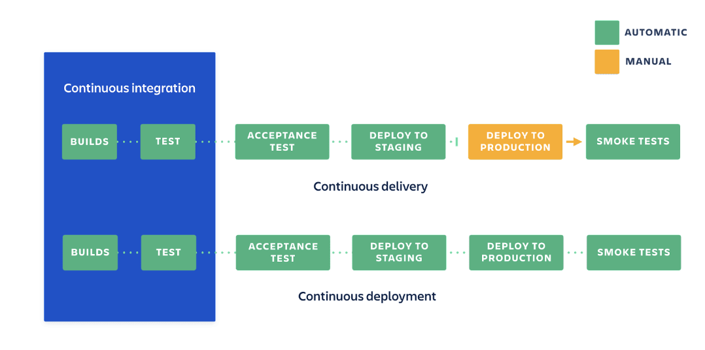
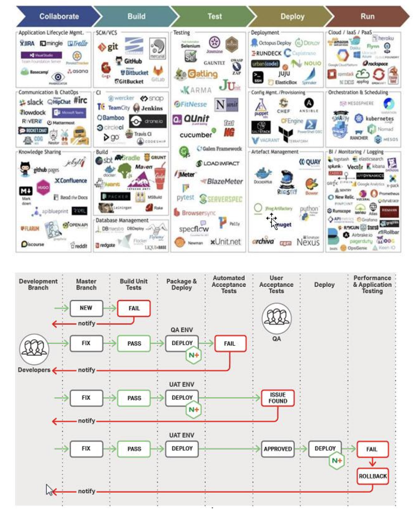
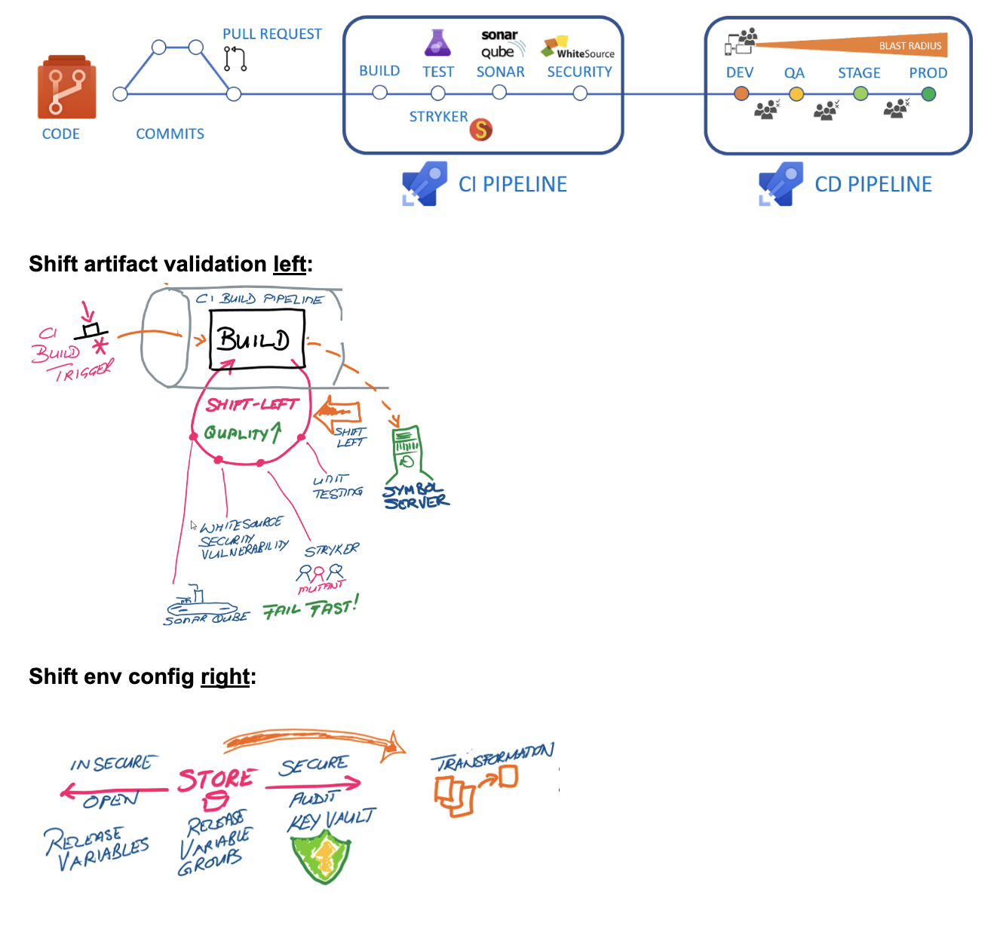
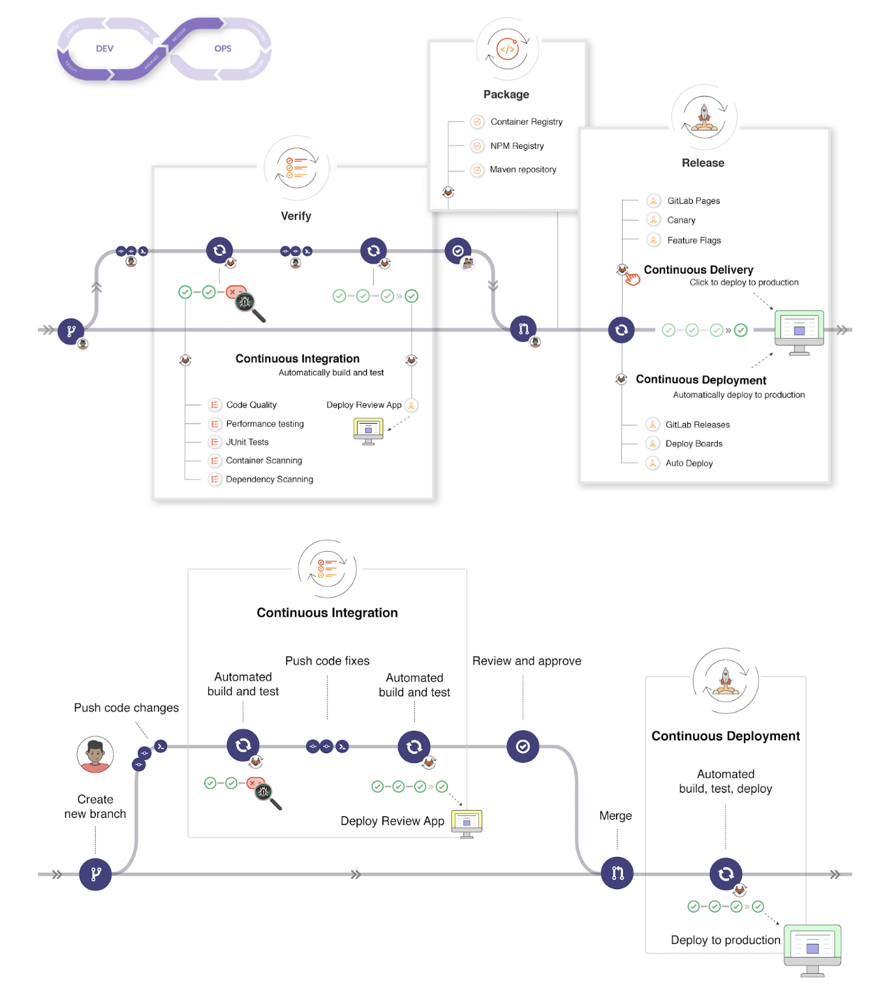
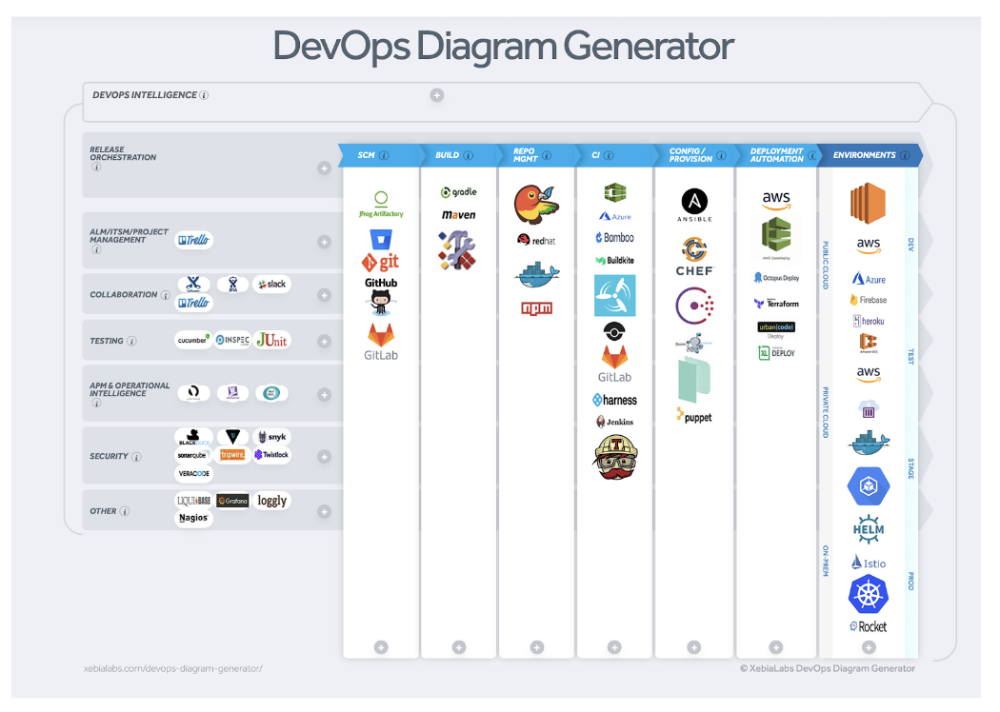
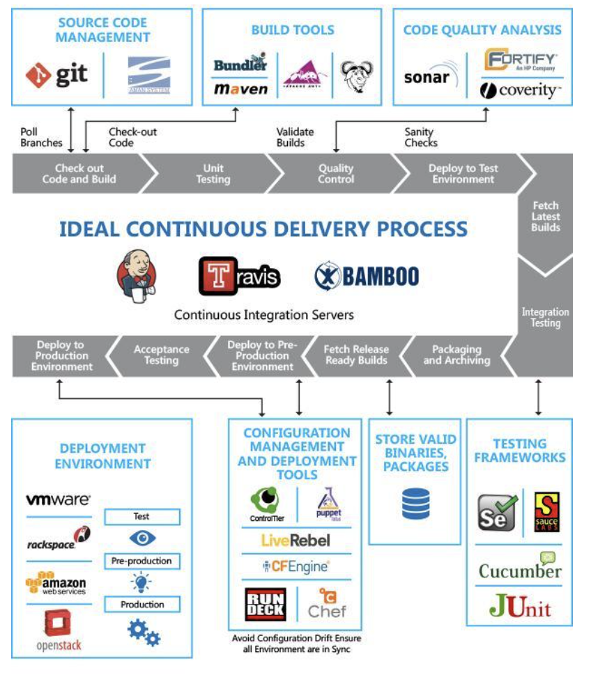

## Continuous Integration, Delivery & Deployment

**Continuous Integration:** Automated testing of built code

**Continuous Delivery:** Automated release/deployment (but manual or non-automatic deploy to prod)

**Continuous Deployment:** Automated release to production

[Atlassian CI/CD Manual vs Auto](https://www.atlassian.com/continuous-delivery/principles/continuous-integration-vs-delivery-vs-deployment)

[Devops University - Build Steps](https://www.devopsuniversity.org/cicd-and-devops/)

[CICD Pipeline to rule them all](https://opensource.com/article/19/7/cicd-pipeline-rule-them-all) - Explains "one commit == one artifact" well.

[GitLab - Development Workflow](https://docs.gitlab.com/ee/ci/introduction/)

DevOps Tools Explained:
- https://www.padok.fr/en/blog/devops-tools-most-used
- https://digital.ai/periodic-table-of-devops-tools

[xebialabs custom devops diagram](https://digital.ai/learn/diagram-generator/) (you can put in fake info to get past the first screen)

https://www.tmasolutions.com/devops

More Info:

- https://continuousdelivery.com/2014/02/visualizations-of-continuous-delivery/
- https://app.lucidchart.com/documents/edit/c3dfdebc-a293-4900-86ef-06138f73f119/0_0

