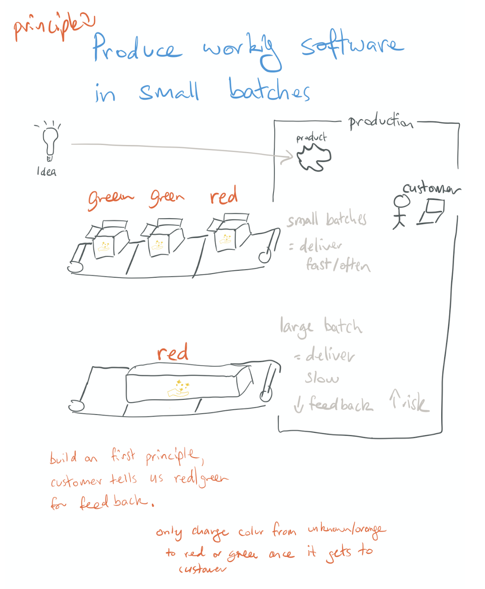

# Transformation and Software Delivery

Why do we care about fast feedback (development)? There's potential for feedback at many stages. If we don't get it fast/early, we're missing out and wasting time.

Why feedback matters (with end users)? It builds trust and helps course correct early, if we do it often.

Transformation & Development: How to explain transformation - it's not just about tech.

Transformation Outline

Transformation on a page

People Influence Tech

Move value through the system

Work in small batches

Deliver working software (vertical slices)

